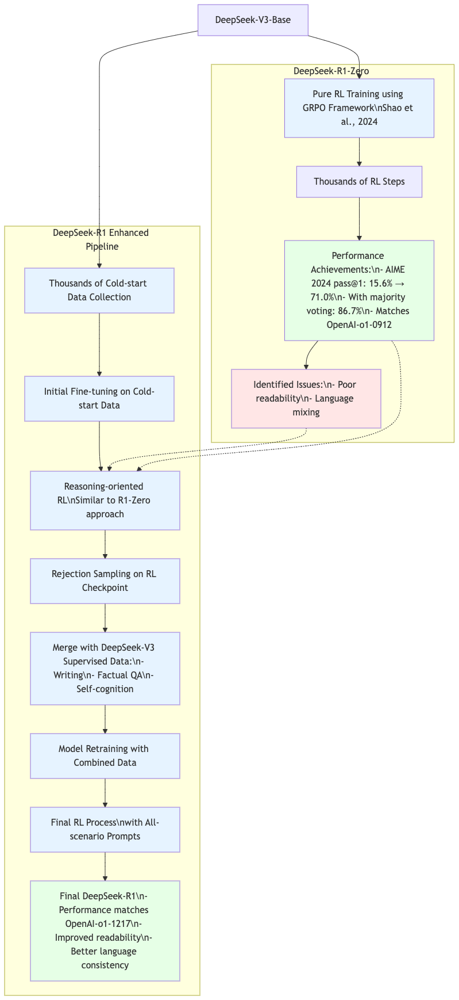

# Mermaid to PNG Converter

Convert Mermaid diagram files to PNG images using Playwright.

## PNG example (after conversion)



## Installation

```bash
# Install Python dependencies
pip install playwright

# Install browser
playwright install chromium
```

## Usage

Convert single file:
```bash
python mermaid_converter.py diagram.mermaid
python mermaid_converter.py diagram.mermaid -o custom_output.png
```

Convert all .mermaid files in a directory:
```bash
python mermaid_converter.py ./diagrams/
```

## Input Format

The tool accepts:
- Single .mermaid files
- Directories containing multiple .mermaid files

## Output

- By default, creates PNG files with the same name as input files
- Use `-o` flag to specify custom output path for single file conversion
- When converting a directory, PNGs are created alongside each .mermaid file

## Requirements

- Python 3.7+
- Playwright
- Chromium (installed via playwright)

## Known Issues

- '\n' in converted PNG
